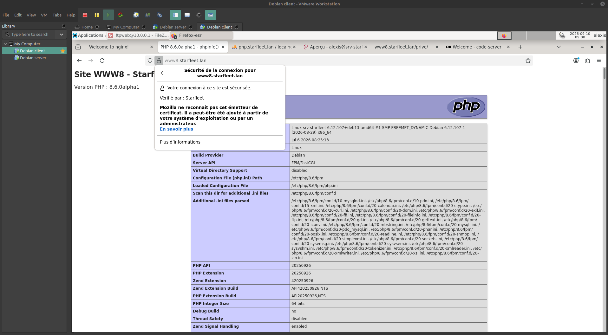

# 🖖 Holodeck — Infrastructure Serveur Starfleet

Projet d'infrastructure système et réseau réalisé dans le cadre du
**Bachelor IT Cybersécurité** (La Plateforme).

Déploiement d'une infrastructure Debian complète virtualisée sous VMware,
hébergeant l'ensemble des services web et réseau pour les ingénieurs de
l'USS Enterprise-D.

---

## 🎯 Objectif

Mettre en place deux machines virtuelles Debian :

- **VM Serveur** (sans interface graphique) : héberge tous les services
- **VM Cliente** (Xfce) : poste de test navigateur

Le tout sur un réseau isolé, avec le domaine `starfleet.lan`.

---

## 🏗️ Architecture

| Élément | Détail |
|---------|--------|
| Serveur | Debian 13 (trixie), 2 Go RAM, 2 vCPU, 2 cartes réseau (WAN NAT / LAN) |
| Client | Debian 13 (Xfce), 2 Go RAM, 2 vCPU, 1 carte réseau (LAN) |
| Réseau LAN | `10.0.0.0/24`, passerelle `10.0.0.1` |
| Domaine | `starfleet.lan` |
| Hyperviseur | VMware Workstation (LAN Segment isolé) |

Le serveur route et masque (NAT) le trafic du client vers Internet via son
interface WAN. Le client n'a aucun accès direct : tout passe par le serveur.

---

## 🧩 Services déployés

| Service | Version | Rôle |
|---------|---------|------|
| **bind9** | 9.20 | DNS : zone directe + inverse + forwarders |
| **isc-dhcp-server** | 4.4.3 | DHCP : plage `10.0.0.100-200` |
| **nftables** | — | Pare-feu (politique `drop` par défaut) + NAT |
| **Nginx** | 1.31.5 (mainline) | Serveur web / reverse proxy HTTPS |
| **PHP** | 7.4.33 + 8.6.0alpha1 | Cohabitation via php-fpm (sockets séparés) |
| **MariaDB** | 12.3.3 | Base de données |
| **phpMyAdmin** | 5.2.3 | Gestion de la base de données |
| **vsftpd** | 3.0.5 | FTP chrooté en TLS |
| **OpenLDAP** | 2.6.10 | Annuaire + authentification web |
| **Cockpit** | 337 | Administration système |
| **code-server** | 4.135.0 | VS Code dans le navigateur |

> Nginx, PHP et MariaDB sont installés depuis les **dépôts upstream officiels**
> (nginx.org, packages.sury.org, mariadb.org) et non depuis les dépôts Debian,
> afin d'obtenir les dernières versions comme exigé par le cahier des charges.

---

## 🌐 Sites & interfaces web

| URL | Contenu |
|-----|---------|
| `www7.starfleet.lan` | Site de démonstration en PHP 7.4 |
| `www8.starfleet.lan` | Site de démonstration en PHP 8.6 (+ zone protégée LDAP `/prive/`) |
| `php.starfleet.lan` | phpMyAdmin |
| `admin.starfleet.lan` | Cockpit (administration de la VM) |
| `vscore.starfleet.lan` | code-server (VS Code Server) |

Toutes les interfaces répondent en **HTTPS**. Un vhost « catch-all » ferme la
connexion (`return 444`) pour tout nom d'hôte non déclaré et pour les accès
par IP directe.

---

## 🔒 Sécurité

- **Aucun compte `sudo`** (directive Starfleet) — l'administration se fait via `su -`
- **Pare-feu nftables** en politique `drop` par défaut : seuls les ports requis sont ouverts (22, 53, 67, 80, 443, 21, 40000-40100)
- **DNS et DHCP restreints à l'interface LAN** (non exposés côté WAN)
- Tout le web en **HTTPS** via une **PKI locale** (autorité de certification + certificat wildcard `*.starfleet.lan`)
- **Certificat partagé** entre le serveur Web et le serveur FTP
- **FTP en TLS obligatoire**, utilisateur chrooté et sans shell de connexion (`nologin`)
- **Authentification LDAP** pour les zones web protégées (pattern `auth_request`)
- **Sauvegarde automatisée** de la configuration (tâche cron quotidienne + rotation)

---

## 🔑 Systèmes d'authentification

Le projet met en œuvre **quatre** systèmes d'authentification distincts :

| Comptes | Utilisés pour |
|---------|---------------|
| Comptes système Linux (`alexis`, `root`) | SSH, console, Cockpit |
| Utilisateurs LDAP (`picard`, `riker`, `data`, `laforge`, `worf`) | Zones web protégées |
| Compte MariaDB (`root`) | phpMyAdmin |
| Compte FTP (`ftpweb`) | Serveur FTP uniquement |

---

## 📁 Structure du dépôt

    holodeck/
    ├── README.md
    ├── .gitignore
    ├── docs/          # Documentation (architecture, installation, export VM, utilisation)
    │   └── images/    # Captures d'écran
    ├── configs/       # Fichiers de configuration de référence (secrets retirés)
    └── scripts/       # Script de sauvegarde de la configuration

---

## 📖 Documentation

- [Architecture & choix techniques](docs/01-architecture.md)
- [Notice d'installation](docs/02-installation.md)
- [Procédure d'export des VM](docs/03-export-vm.md)
- [Notice d'utilisation](docs/04-utilisation.md)
- [Présentation de soutenance (PDF)](presentation/Holodeck-presentation.pdf)

---

## 👤 Auteur

**Alexis Noiret** — Bachelor IT Cybersécurité, La Plateforme

- Portfolio : [alexis-noiret.students-laplateforme.io](https://alexis-noiret.students-laplateforme.io)
- GitHub : [github.com/alexis-noiret](https://github.com/alexis-noiret)
