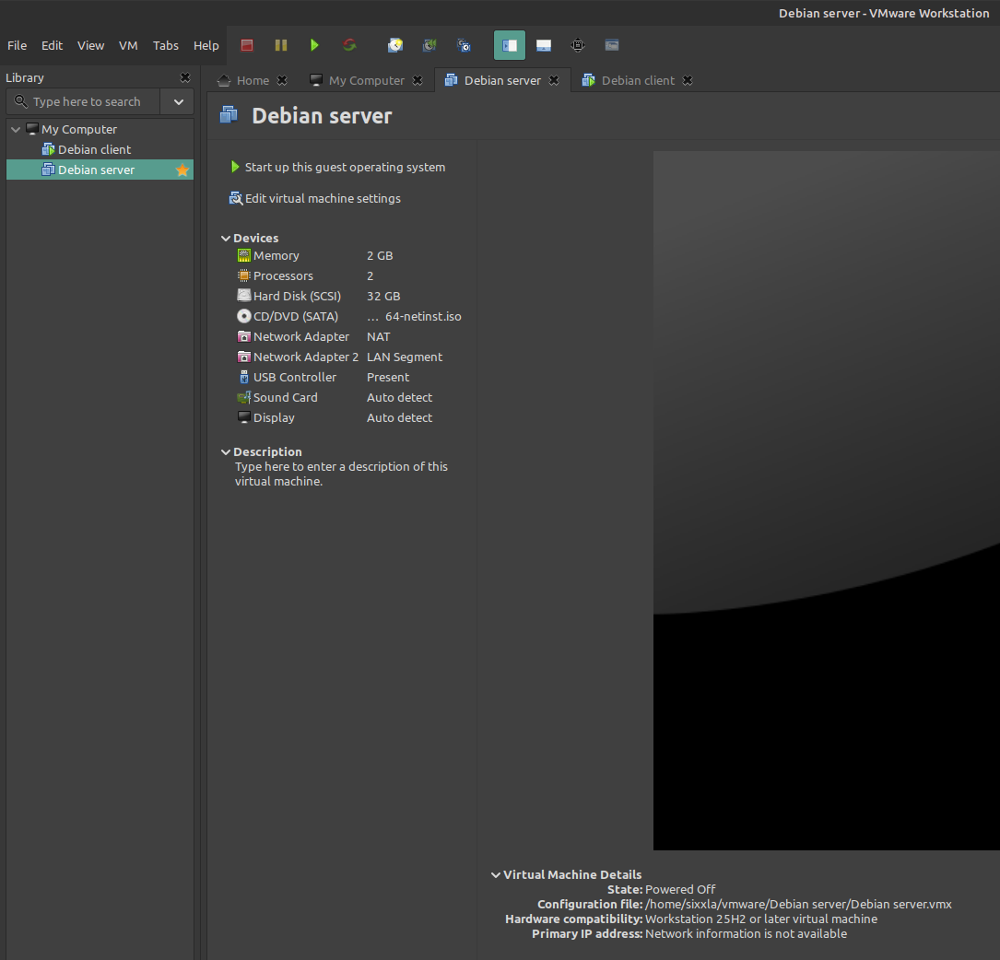
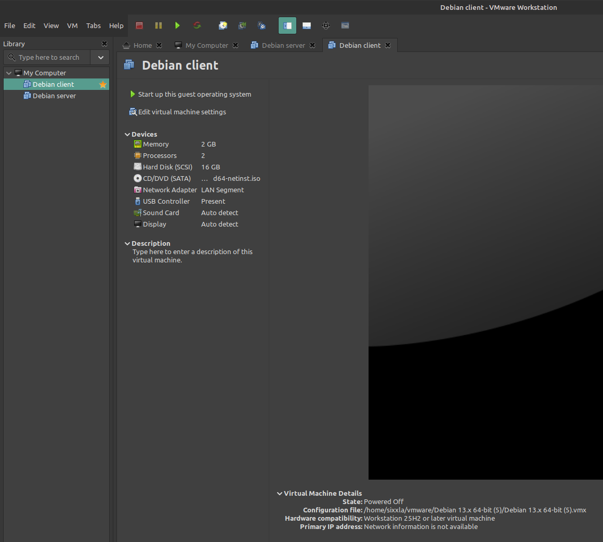
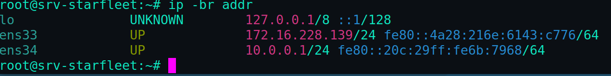
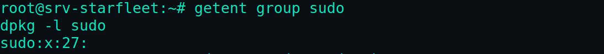
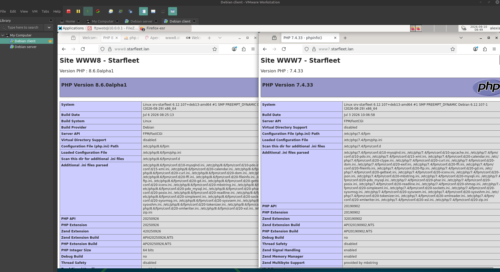
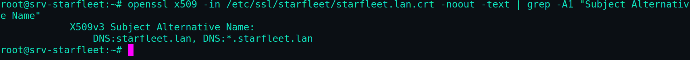
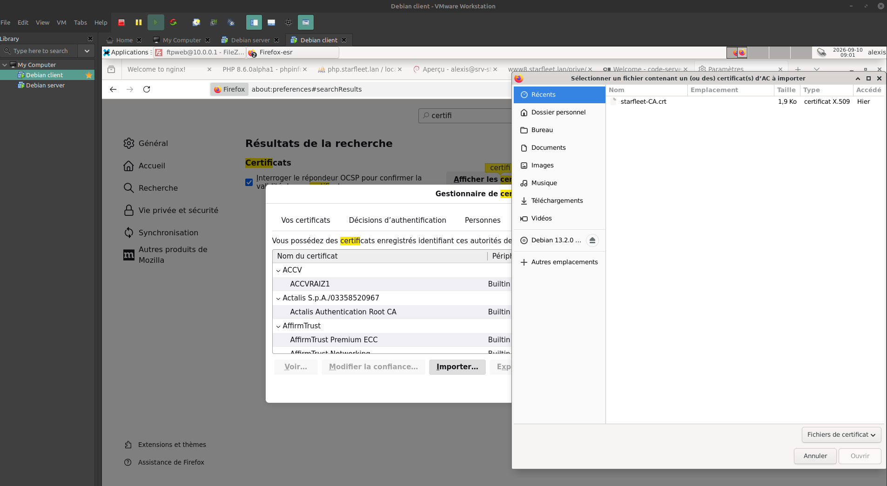
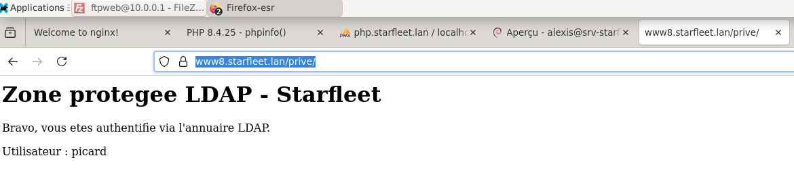
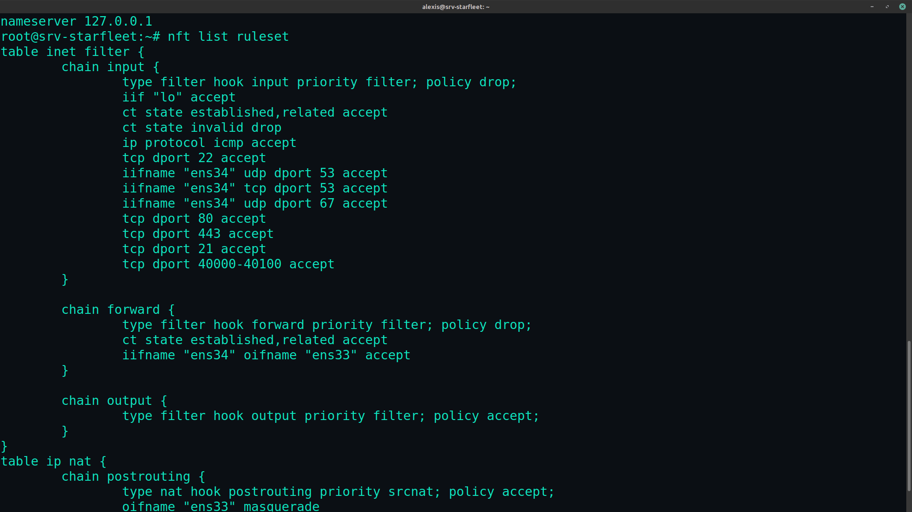

# 01 — Architecture & choix techniques

## Vue d'ensemble

L'infrastructure repose sur **deux machines virtuelles Debian 13** reliées par
un réseau privé isolé (`starfleet.lan`, `10.0.0.0/24`).

```
                 Internet
                    │
                    │  (NAT VMware - vmnet8)
                    │
          ┌─────────┴──────────┐
          │   VM SERVEUR        │
          │   srv-starfleet     │
          │                     │
          │  ens33 (WAN)  ──────┼──► 172.16.228.x  (NAT / accès Internet)
          │  ens34 (LAN)  ──────┼──► 10.0.0.1      (services + passerelle)
          │                     │
          │  DNS · DHCP · Web   │
          │  SQL · FTP · LDAP   │
          └─────────┬───────────┘
                    │  LAN Segment "starfleet-lan" (isolé, sans DHCP VMware)
                    │
          ┌─────────┴──────────┐
          │   VM CLIENTE        │
          │   cli-starfleet     │
          │  ens33 (LAN) ───────┼──► 10.0.0.100 (via DHCP du serveur)
          │  Xfce + Firefox     │
          └────────────────────┘
```

Le serveur possède **deux interfaces** : une patte WAN (NAT VMware) pour
l'accès Internet, une patte LAN pour le réseau interne. Il assure le routage
et le NAT entre les deux, si bien que le client — qui n'a qu'une patte LAN —
accède à Internet **uniquement à travers le serveur**.







---

## Choix de virtualisation

| Choix | Justification |
|-------|---------------|
| **LAN Segment VMware** (plutôt qu'un VMnet custom) | Réseau réellement isolé partagé entre les deux VM, **sans serveur DHCP VMware** — évite tout conflit avec le DHCP que l'on installe sur le serveur |
| WAN en **NAT** | Donne au serveur un accès Internet sortant sans l'exposer, suffisant pour installer les paquets |
| Client **sans WAN** | Force tout le trafic du client à transiter par le serveur, ce qui permet de tester réellement le routage, le DNS et le NAT |

---

## Choix système

### Pas de compte sudo

Conformément aux directives du cahier des charges, **aucun utilisateur n'est
membre du groupe `sudo`** et le paquet `sudo` est absent. L'administration se
fait :

- soit en se connectant directement en `root`,
- soit via `su -` depuis un compte utilisateur.

Conformité vérifiable :

```bash
getent group sudo      # aucun membre listé
dpkg -l sudo           # paquet absent
```



### Dépôts upstream plutôt que Debian

Le cahier des charges impose les **dernières versions** de PHP, MariaDB et
Nginx. Les dépôts Debian étant volontairement conservateurs, on ajoute les
dépôts officiels amont :

| Logiciel | Dépôt | Raison |
|----------|-------|--------|
| PHP 7.4 + 8.6 | `packages.sury.org` | Seul dépôt permettant la **cohabitation** de plusieurs versions de PHP |
| MariaDB 12.3 | `mariadb.org` | Dernière version stable |
| Nginx 1.31 | `nginx.org` (mainline) | Dernière version |

---

## La cohabitation PHP 7.4 / 8.6

C'est le point central du projet. Chaque version de PHP tourne comme un
**service php-fpm indépendant**, avec son propre socket Unix :

```
/run/php/php7.4-fpm.sock
/run/php/php8.6-fpm.sock
```

Nginx aiguille ensuite chaque site vers le bon socket selon le nom d'hôte :

- `www7.starfleet.lan` → `php7.4-fpm.sock`
- `www8.starfleet.lan` → `php8.6-fpm.sock`

Les deux versions ne se rencontrent jamais : c'est Nginx qui décide, requête
par requête, quel interpréteur utiliser.



---

## Le reverse proxy Nginx

Nginx joue deux rôles :

1. **Serveur web** classique pour les sites PHP (`www7`, `www8`) et phpMyAdmin.
2. **Reverse proxy HTTPS** devant les applications qui tournent sur leur propre
   port : Cockpit (9090) et code-server (8080). Nginx assure la façade TLS et
   transmet le trafic en local, WebSocket compris.

Un **vhost catch-all** (`return 444`) ferme toute connexion vers un nom d'hôte
non déclaré ou un accès par IP directe — ce qui évite qu'un service réponde par
défaut à la place d'un autre.

---

## La PKI (chaîne de confiance)

Une **autorité de certification locale** (`Starfleet Root CA`) signe un
**certificat wildcard `*.starfleet.lan`**. Ce certificat unique :

- couvre tous les sous-domaines (`www7`, `www8`, `php`, `admin`, `vscore`),
- est **partagé entre le serveur Web et le serveur FTP** (exigence du sujet),
- est reconnu sans avertissement une fois la CA importée dans le navigateur du
  client.

L'usage des **SAN** (Subject Alternative Names) est indispensable : les
navigateurs modernes ignorent le champ CN et exigent les SAN pour valider un
certificat.





---

## L'authentification LDAP côté web

Nginx open-source **ne dispose pas** de module d'authentification LDAP natif.
La solution retenue s'appuie sur la directive native **`auth_request`** :

```
Navigateur ──► Nginx ──► (sous-requête) ──► démon Python ──► OpenLDAP
                 │                                              │
                 │◄──────────── 200 (OK) / 401 (refusé) ◄───────┘
```

Avant de servir une page protégée, Nginx interroge un petit démon
d'authentification qui vérifie les identifiants contre l'annuaire OpenLDAP et
répond `200` (autorisé) ou `401` (refusé). C'est le pattern moderne de
**délégation d'authentification**, que l'on retrouve dans des solutions comme
Authelia ou oauth2-proxy.



---

## Synthèse des flux réseau autorisés (pare-feu)

Le pare-feu **nftables** applique une politique `drop` par défaut. Seuls sont
ouverts :

| Port | Service | Portée |
|------|---------|--------|
| 22 | SSH | Toutes interfaces |
| 53 | DNS | LAN uniquement |
| 67 | DHCP | LAN uniquement |
| 80 / 443 | HTTP / HTTPS | Toutes interfaces |
| 21 | FTP (commande) | Toutes interfaces |
| 40000-40100 | FTP (données passives) | Toutes interfaces |

Le NAT (masquerade) est appliqué en sortie sur l'interface WAN, et le
forwarding LAN → WAN est autorisé pour donner Internet au client.


