# 02 — Notice d'installation

Cette notice décrit le déploiement complet de l'infrastructure, du réseau
VMware jusqu'aux services. Toutes les commandes serveur sont exécutées en
**root** (pas de sudo).

> Les fichiers de configuration référencés se trouvent dans le dossier
> [`configs/`](../configs) du dépôt.

---

## 1. Machines virtuelles (VMware)

### VM Serveur
- Debian 13 **sans interface graphique**
- 2 Go RAM · 2 vCPU · disque 32 Go
- **2 cartes réseau** : Adaptateur 1 = **NAT** (WAN), Adaptateur 2 = **LAN Segment** `starfleet-lan`

### VM Cliente
- Debian 13 **avec Xfce**
- 2 Go RAM · 2 vCPU · disque 16 Go
- **1 carte réseau** sur le même **LAN Segment** `starfleet-lan`

> Créer le LAN Segment via *VM Settings → Network Adapter → LAN Segment →
> LAN Segments… → Add*. Il ne fournit aucun DHCP, ce qui évite les conflits.

### Points clés de l'installation Debian
- Définir un **mot de passe root** → garantit que l'utilisateur créé n'est PAS dans le groupe sudo.
- Tasksel serveur : décocher l'environnement de bureau **et** « serveur web » (Apache), ne garder que **SSH** + **utilitaires usuels**.
- Tasksel client : cocher **Xfce** + SSH.


---

## 2. Configuration réseau du serveur

Identifier les interfaces :

```bash
ip -br link      # ens33 = WAN, ens34 = LAN
```

Éditer `/etc/network/interfaces` :

```
auto lo
iface lo inet loopback

allow-hotplug ens33
iface ens33 inet dhcp

auto ens34
iface ens34 inet static
    address 10.0.0.1
    netmask 255.255.255.0
```

> Aucune passerelle sur la LAN : la route par défaut vient uniquement de la WAN.

Activer le routage :

```bash
echo "net.ipv4.ip_forward=1" > /etc/sysctl.d/99-forwarding.conf
sysctl --system
systemctl restart networking
```

Figer la résolution DNS sur le serveur lui-même :

```bash
echo "nameserver 127.0.0.1" > /etc/resolv.conf
chattr +i /etc/resolv.conf     # empeche l'ecrasement au reboot
```


---

## 3. DNS (bind9)

```bash
apt install -y bind9 bind9utils dnsutils
```

Configurer :
- `/etc/bind/named.conf.local` — déclaration des zones directe et inverse
- `/etc/bind/named.conf.options` — forwarders (8.8.8.8, 1.1.1.1) + `dnssec-validation no`
- `/etc/bind/db.starfleet.lan` — zone directe (tous les sous-domaines → 10.0.0.1)
- `/etc/bind/db.10.0.0` — zone inverse

Vérifier puis redémarrer :

```bash
named-checkconf
named-checkzone starfleet.lan /etc/bind/db.starfleet.lan
named-checkzone 0.0.10.in-addr.arpa /etc/bind/db.10.0.0
systemctl restart named
```

Tester : `dig @10.0.0.1 www8.starfleet.lan +short` doit renvoyer `10.0.0.1`.

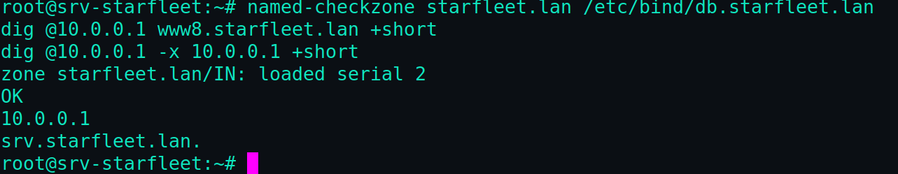

---

## 4. DHCP (isc-dhcp-server)

```bash
apt install -y isc-dhcp-server
```

- `/etc/default/isc-dhcp-server` → `INTERFACESv4="ens34"`
- `/etc/dhcp/dhcpd.conf` → `authoritative;` + bloc `subnet 10.0.0.0` (plage `.100-.200`, routeur et DNS `10.0.0.1`)

```bash
systemctl restart isc-dhcp-server
```

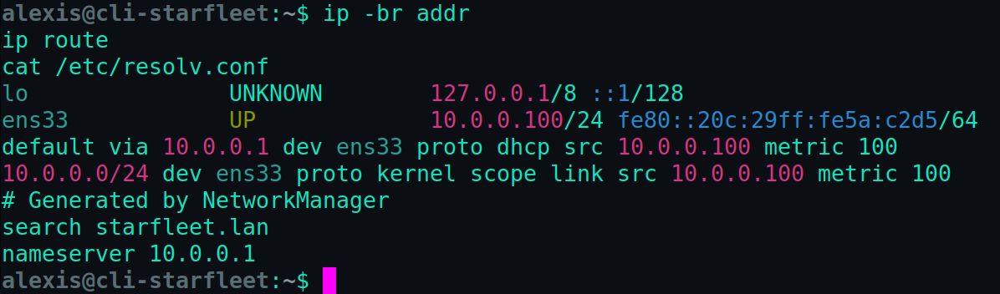

---

## 5. Pare-feu (nftables)

Éditer `/etc/nftables.conf` (politique `drop` + NAT), puis :

```bash
nft -f /etc/nftables.conf
systemctl enable --now nftables
```

> Toujours garder une console VMware ouverte lors du passage en `policy drop`,
> et s'assurer que la règle SSH (port 22) est présente avant de recharger.


---

## 6. PKI (certificats SSL)

```bash
mkdir -p /etc/ssl/starfleet && cd /etc/ssl/starfleet

# Autorite de certification
openssl genrsa -out starfleet-CA.key 4096
openssl req -x509 -new -nodes -key starfleet-CA.key -sha256 -days 3650 \
  -out starfleet-CA.crt -subj "/C=FR/O=Starfleet/CN=Starfleet Root CA"

# Certificat wildcard
openssl genrsa -out starfleet.lan.key 2048
openssl req -new -key starfleet.lan.key -out starfleet.lan.csr \
  -subj "/C=FR/O=Starfleet/CN=*.starfleet.lan"
```

Fichier `san.ext` (SAN indispensables), puis signature :

```bash
openssl x509 -req -in starfleet.lan.csr \
  -CA starfleet-CA.crt -CAkey starfleet-CA.key -CAcreateserial \
  -out starfleet.lan.crt -days 825 -sha256 -extfile san.ext

chmod 600 /etc/ssl/starfleet/*.key
```

> Importer `starfleet-CA.crt` dans Firefox du client (onglet *Autorités*) pour
> obtenir le cadenas sans avertissement.


---

## 7. Base de données (MariaDB)

```bash
curl -LsS https://r.mariadb.com/downloads/mariadb_repo_setup | bash
apt update && apt install -y mariadb-server mariadb-client
mariadb-secure-installation
```

---

## 8. PHP 7.4 + 8.6 (dépôt Sury)

```bash
curl -sSL https://packages.sury.org/php/apt.gpg -o /etc/apt/trusted.gpg.d/sury-php.gpg
echo "deb https://packages.sury.org/php/ $(lsb_release -sc) main" > /etc/apt/sources.list.d/sury-php.list
apt update

apt install -y \
  php7.4-fpm php7.4-cli php7.4-mysql php7.4-mbstring php7.4-xml php7.4-curl php7.4-gd php7.4-zip \
  php8.6-fpm php8.6-cli php8.6-mysql php8.6-mbstring php8.6-xml php8.6-curl php8.6-gd php8.6-zip
```

Deux sockets doivent exister : `ls -l /run/php/`

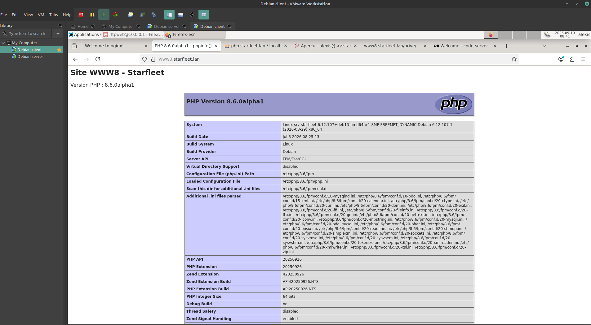

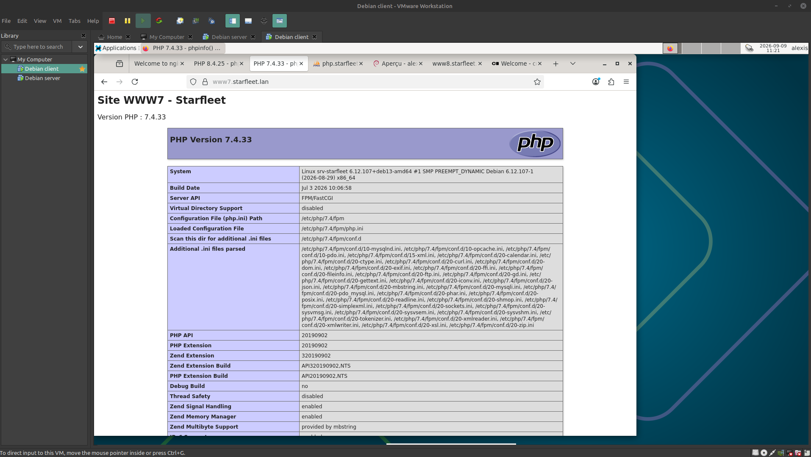

---

## 9. Serveur web (Nginx)

```bash
curl -sSL https://nginx.org/keys/nginx_signing.key | gpg --dearmor -o /etc/apt/trusted.gpg.d/nginx.gpg
echo "deb https://nginx.org/packages/mainline/debian/ $(lsb_release -sc) nginx" > /etc/apt/sources.list.d/nginx.list
apt update && apt install -y nginx
```

- Régler `user www-data;` dans `/etc/nginx/nginx.conf` (alignement avec php-fpm)
- Créer les vhosts dans `/etc/nginx/conf.d/` : `www7`, `www8`, `php`, `admin`, `vscore`, catch-all
- Ouvrir 80 et 443 dans nftables

```bash
nginx -t && systemctl reload nginx
```

---

## 10. phpMyAdmin

Déployer la dernière version depuis phpmyadmin.net dans `/var/www/phpmyadmin`,
générer le `blowfish_secret`, créer le dossier `tmp`, puis le vhost
`php.starfleet.lan`.

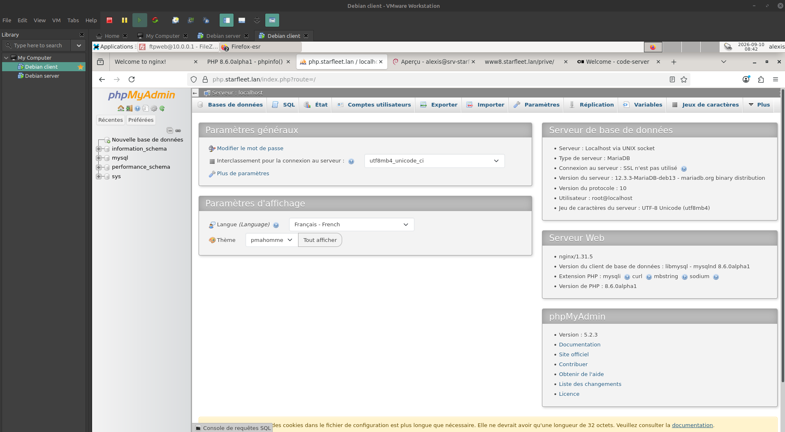

---

## 11. FTP (vsftpd)

```bash
apt install -y vsftpd
useradd -d /var/www -s /usr/sbin/nologin ftpweb
passwd ftpweb
echo "/usr/sbin/nologin" >> /etc/shells    # autorise l'auth FTP sans shell
echo "ftpweb" > /etc/vsftpd.userlist
```

Config `/etc/vsftpd.conf` : chroot, TLS obligatoire (certif partagé),
mode passif `40000-40100`. Ouvrir les ports FTP dans nftables.

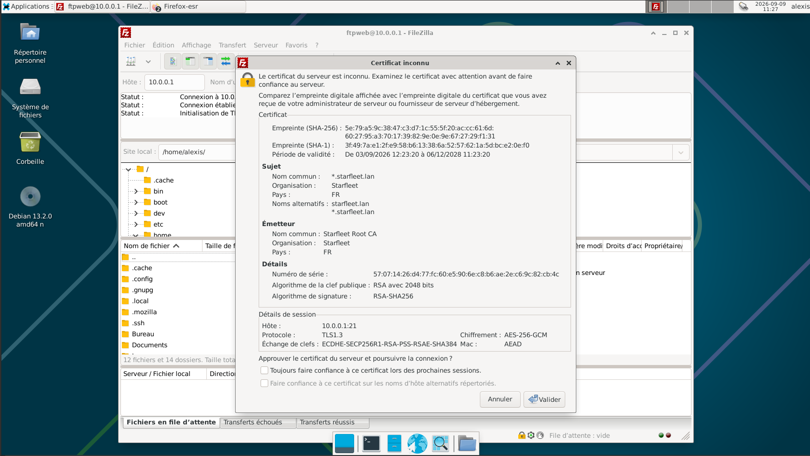

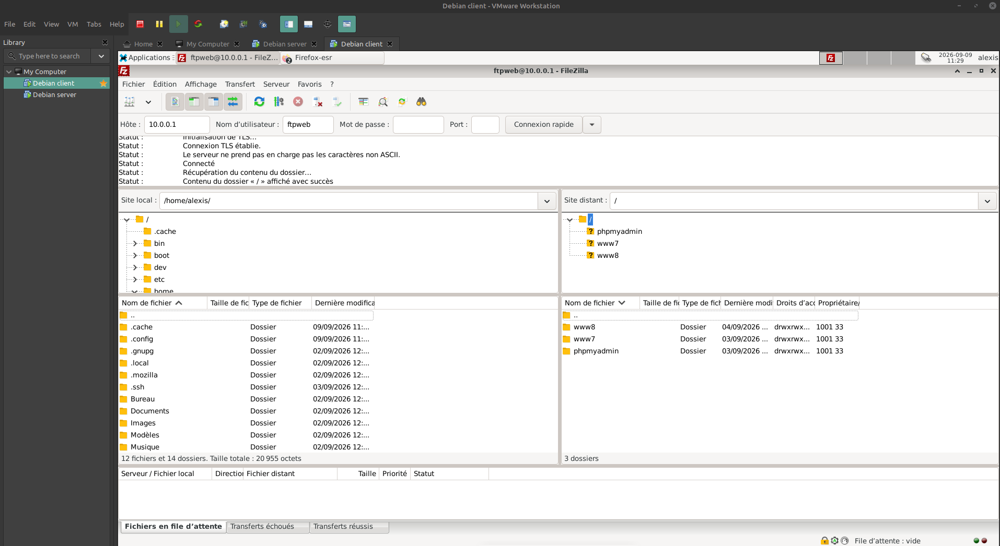

---

## 12. Annuaire LDAP (OpenLDAP)

```bash
apt install -y slapd ldap-utils
dpkg-reconfigure slapd      # domaine : starfleet.lan
```

Créer l'OU `people` et les utilisateurs via des fichiers LDIF (`ldapadd`).
Chaque entrée LDIF doit être séparée par une **ligne vide**.

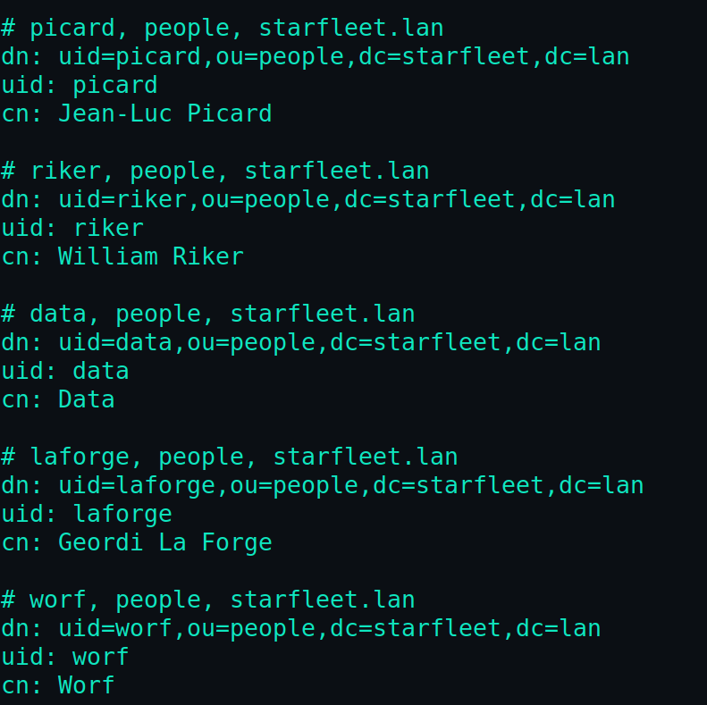

---

## 13. Authentification LDAP dans Nginx

```bash
apt install -y python3 python3-ldap
mkdir -p /opt/ldap-auth && cd /opt/ldap-auth
wget https://raw.githubusercontent.com/nginxinc/nginx-ldap-auth/master/nginx-ldap-auth-daemon.py
```

Créer le service systemd `nginx-ldap-auth` (écoute sur `127.0.0.1:8888`),
puis protéger une zone (`/prive/`) avec `auth_request` dans le vhost www8.


---

## 14. Administration & développement

```bash
# Cockpit (admin.starfleet.lan)
apt install -y cockpit

# code-server (vscore.starfleet.lan)
curl -fsSL https://code-server.dev/install.sh | sh
systemctl enable --now code-server@alexis
```

Les deux sont exposés via des vhosts Nginx en reverse proxy (WebSocket activé).

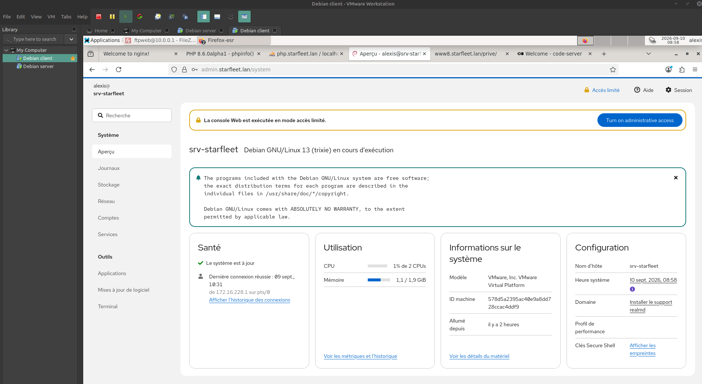

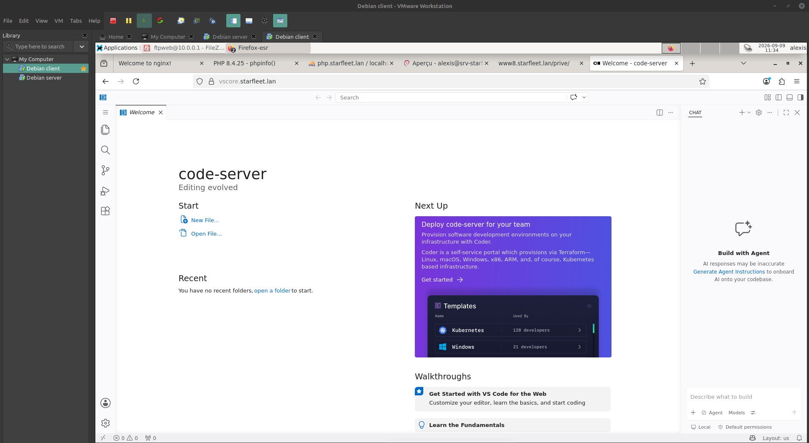

---

## 15. Sauvegarde automatisée

Déployer `scripts/backup-config.sh` dans `/opt/backup/`, le rendre exécutable,
et planifier via cron :

```
0 2 * * * /opt/backup/backup-config.sh >> /var/log/backup-starfleet.log 2>&1
```

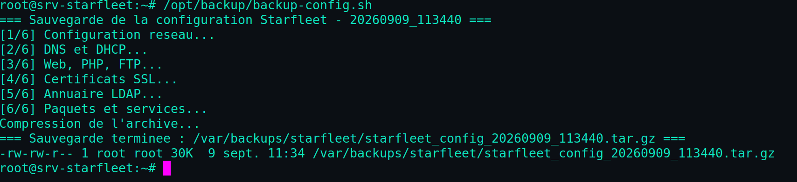

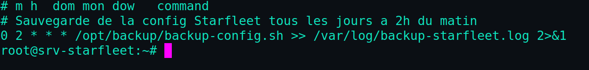
