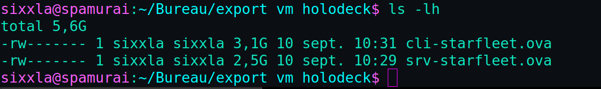

# 03 — Procédure d'export des VM

Cette procédure explique comment exporter les deux machines virtuelles pour
les archiver ou les transmettre (format **OVF/OVA**, portable et standard).

---

## Avant d'exporter

1. **Éteindre proprement** les deux VM (arrêt système, pas une pause) :
   ```bash
   # sur chaque VM, en root
   poweroff
   ```
   Une VM exportée à chaud peut produire une image incohérente.

2. **Noter l'état réseau** : l'IP WAN du serveur est distribuée par le NAT
   VMware et peut changer d'un hôte à l'autre. Ce n'est pas un problème :
   la configuration LAN (`10.0.0.1`) est statique et se retrouvera à
   l'identique après import.

3. **Lancer une sauvegarde de configuration** juste avant l'export, pour
   disposer d'une archive de secours :
   ```bash
   /opt/backup/backup-config.sh
   ```

---

## Export au format OVA (VMware Workstation)

### Méthode graphique

1. Sélectionner la VM dans la bibliothèque VMware.
2. Menu **File → Export to OVF…**
3. Choisir l'emplacement et le nom du fichier.
4. Répéter l'opération pour la VM cliente.

Le format **OVA** produit un fichier unique (archive) contenant la définition
de la VM et son disque — pratique à transmettre. Le format **OVF** produit
plusieurs fichiers (`.ovf`, `.vmdk`, `.mf`).

### Méthode en ligne de commande (ovftool)

VMware fournit l'utilitaire `ovftool`, qui permet de produire directement un
fichier `.ova` unique :

```bash
ovftool "/chemin/vers/Debian server.vmx" srv-starfleet.ova
ovftool "/chemin/vers/Debian client.vmx" cli-starfleet.ova
```

Chaque export se termine par `Completed successfully`.



---

## Import / restauration

Sur une autre machine disposant de VMware :

1. **File → Open…** et sélectionner le fichier `.ova`.
2. Choisir un nom et un emplacement pour la VM importée.
3. VMware convertit et importe automatiquement.

### Après import — vérifications réseau

Le point le plus sensible après un import est le **LAN Segment** : il faut
s'assurer que les deux VM sont bien rattachées au **même** segment isolé.

1. Sur chaque VM : **VM Settings → Network Adapter**
   - Serveur : Adaptateur 1 = **NAT**, Adaptateur 2 = **LAN Segment** commun
   - Client : Adaptateur = **même LAN Segment**
2. Recréer le LAN Segment si nécessaire (*LAN Segments… → Add*).
3. Démarrer d'abord le **serveur**, attendre que ses services soient prêts,
   puis démarrer le **client** pour qu'il obtienne son bail DHCP.

### Vérifications de bon fonctionnement

```bash
# Sur le serveur
ip -br addr                       # ens34 = 10.0.0.1/24
systemctl status named isc-dhcp-server nginx mariadb --no-pager

# Sur le client
ip -br addr                       # une IP dans 10.0.0.100-200
ping -c2 10.0.0.1                 # connectivite LAN
```

Puis, dans Firefox du client, vérifier que `https://www8.starfleet.lan`
répond correctement.

---

## Bonnes pratiques

- Les fichiers OVA sont volumineux (plusieurs Go) : les transmettre via un
  espace de partage adapté, pas dans le dépôt Git.
- **Conserver la CA** (`starfleet-CA.crt`) séparément pour pouvoir la
  réimporter dans le navigateur après restauration.
- Ne **jamais** inclure de secrets (clés privées, mots de passe) dans une
  documentation publique accompagnant les exports.
